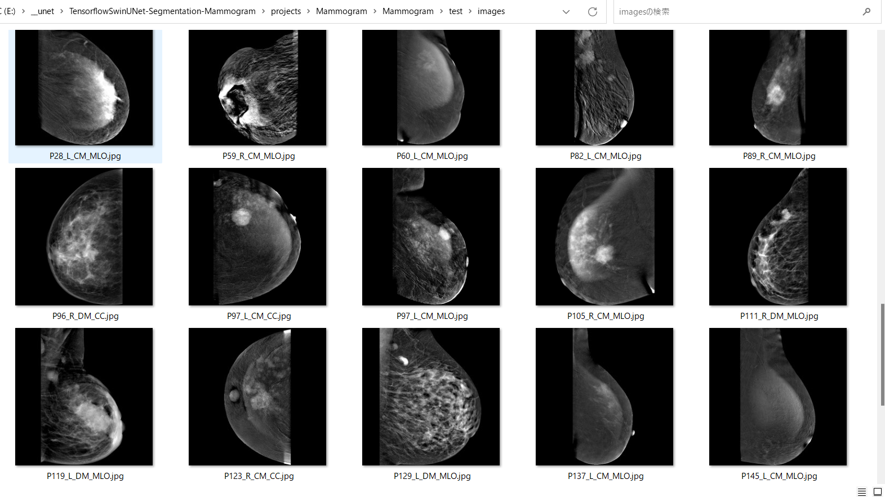
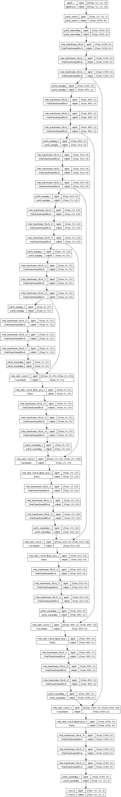

# TensorflowSwinUNet-Segmentation-CDD-CESM-Mammogram (Updated 2023/07/21)
<h2>
1 TensorflowSwinUNet-Segmentation-CDD-CESM-Mammogram 
</h2>

This is an experimental project detect Mammogram  by using 
TensorflowSwinUNetModel,which is a Tensorflow 2 implementation of
<a href="https://arxiv.org/pdf/2105.05537.pdf">
<b>Swin-Unet: Unet-like Pure Transformer for Medical Image Segmentation</b>
</a>.

In order to write the <a href="./TensorflowSwinUNet.py">TensorflowSwinUNet</a> Python class, we have used the Python code in the following web sites.

<pre>
1.keras-unet-collection
 https://github.com/yingkaisha/keras-unet-collection/tree/main/keras_unet_collection
</pre>

Please see also: 
<pre>
2. U-Net: Convolutional Networks for Biomedical Image Segmentation
 https://arxiv.org/pdf/1505.04597.pdf
</pre>
<pre>
3. Swin-Unet: Unet-like Pure Transformer for Medical Image Segmentation
 https://arxiv.org/pdf/2105.05537.pdf
</pre>
<pre>
4. Image-Segmentation-CDD-CESM-Mammogram
 https://github.com/sarah-antillia/Image-Segmentation-CDD-CESM-Mammogram
</pre>

The image dataset used here has been taken from the following web site. 
<pre>
Categorized Digital Database for Low energy and Subtracted Contrast Enhanced Spectral Mammography images (CDD-CESM)
https://wiki.cancerimagingarchive.net/pages/viewpage.action?pageId=109379611#109379611bcab02c187174a288dbcbf95d26179e8
</pre>
<pre>
Citations & Data Usage Policy
Users must abide by the TCIA Data Usage Policy and Restrictions. Attribution should include references to the following citations:

Data Citation
Khaled R., Helal M., Alfarghaly O., Mokhtar O., Elkorany A., El Kassas H., Fahmy A. Categorized Digital Database 
for Low energy and Subtracted Contrast Enhanced Spectral Mammography images [Dataset]. (2021) The Cancer Imaging
 Archive. DOI:  10.7937/29kw-ae92 

Publication Citation
Khaled, R., Helal, M., Alfarghaly, O., Mokhtar, O., Elkorany, A., El Kassas, H., & Fahmy, A. Categorized contrast
 enhanced mammography dataset for diagnostic and artificial intelligence research. (2022) Scientific Data, 
 Volume 9, Issue 1. DOI: 10.1038/s41597-022-01238-0

TCIA Citation
Clark K, Vendt B, Smith K, Freymann J, Kirby J, Koppel P, Moore S, Phillips S, Maffitt D, Pringle M, Tarbox L,
 Prior F. The Cancer Imaging Archive (TCIA): Maintaining and Operating a Public Information Repository, 
 Journal of Digital Imaging, Volume 26, Number 6, December, 2013, pp 1045-1057. DOI: 10.1007/s10278-013-9622-7
</pre>

 
<h2>
2. Install TensorflowSwinUNet-Segmentation-CDD-CESM-Mammogram 
</h2>
Please clone TensorflowSwinUNet-Segmentation-CDD-CESM-Mammogram.git in a folder <b>c:\google</b>. 
<pre>
>git clone https://github.com/sarah-antillia/TensorflowSwinUNet-Segmentation-CDD-CESM-Mammogram.git 
</pre>
You can see the following folder structure in your working folder. 

<pre>
TensorflowSwinUNet-Segmentation-CDD-CESM-Mammogram 
├─asset
└─projects
    └─Mammogram
        ├─eval
        ├─generator
        ├─Mammogram
        │  ├─test
        │  │  ├─images
        │  │  └─masks
        │  ├─train
        │  │  ├─images
        │  │  └─masks
        │  └─valid
        │      ├─images
        │      └─masks
        ├─mini_test_output
        ├─mini_test_output_merged
        └─models
</pre>

<h2>
3 Prepare dataset
</h2>

<h3>
3.1 Download master dataset
</h3>
  Please download the original image and assocated annotation and segmentation files from the following link. 
<pre>
Categorized Digital Database for Low energy and Subtracted Contrast Enhanced Spectral Mammography images (CDD-CESM)
https://wiki.cancerimagingarchive.net/pages/viewpage.action?pageId=109379611#109379611bcab02c187174a288dbcbf95d26179e8
</pre>
The dataset has the following folder structure. 
<pre>
CDD-CESM
├─Low energy images of CDD-CESM
└─Subtracted images of CDD-CESM
</pre>.
and csv and xlsx files .
<pre>
CDD-CESM
├─Radiology_hand_drawn_segmentations_v2.csv
├─Radiology-manual-annotations.csv
└─Radiology-manual-annotations.xlsx
</pre>,
where Radiology-manual-annotations.csv is just a converted csv file from the original xlsx file. 
<pre>
 Radiology manual annotations.xlsx
</pre>
This csv file will be used to identify a category ("Benign", "Malgnant") of each image in CDD-CESM dataset. 
<h3>
3.2 Create Malignant image and mask dataset
</h3>
By using Python script <a href="./projects/Mammogram/generator/ImageMaskDatasetGenerator.py">ImageMaskDatasetGenerator.py</a>,
 we have created <b>Malignant CDD-CESM-master</b> dataset from the original image jpg files and mask data files
in the <b>CDD-CESM</b> folder. 
On detail to create <b>CDD-CESM-master</b> dataset, please see <a href="https://github.com/sarah-antillia/Image-Segmentation-CDD-CESM-Mammogram
">Image-Segmentation-CDD-CESM-Mammogram</a>.
 
The created <b>CDD-CESM-master</b> dataset has the following folder structure. 
<pre>
CDD-CESM-master
└─malignant
    ├─images
    └─masks
</pre>

<h3>
3.3 Split master to test, train and valid 
</h3>
By using Python script <a href="./projects/Mammogram/generator/split_master.py">split_master.py</a>,
 we have finally created <b>Mammogram</b> dataset from the CDD-CESM-master. 
<pre>
├─test
│  ├─images
│  └─masks
├─train
│  ├─images
│  └─masks
└─valid
    ├─images
    └─masks
</pre>
<b>train/images samples:</b> 

 
<b>train/masks samples:</b> 

 

<h2>
4 Train TensorflowSwinUNet Model
</h2>
 We have trained Mammogram TensorflowSwinUNet Model by using the following
 <b>train_eval_infer.config</b> file.  
Please move to ./projects/Mammogram directory and run the following bat file. 
<pre>
>1.train.bat
</pre>
, which simply runs the following command. 
<pre>
>python ../../TensorflowSwinUNetTrainer.py ./train_eval_infer.config
</pre>

<pre>
; train_eval_infer.config
; 2023/07/21 antillia.com
;
[model]
image_width    = 512
image_height   = 512
image_channels = 3
num_classes    = 1
;filter_num_begin = 128
filter_num_begin = 16
; number of channels in the first downsampling block; it is also the number of embedded dimensions

;depth = 4
depth = 6
; the depth of SwinUNET; depth=4 means three down/upsampling levels and a bottom level 

;stack_num_down = 2
stack_num_down = 3
; number of Swin Transformers per downsampling level

;stack_num_up = 2
stack_num_up = 3
; number of Swin Transformers per upsampling level

patch_size = (4, 4)  
; Extract 4-by-4 patches from the input image. Height and width of the patch must be equal.  

;num_heads = [4, 8, 8, 8]   
num_heads = [4, 4, 8, 8, 8, 8]   
;number of attention heads per down/upsampling level

;window_size = [4, 2, 2, 2] 
window_size = [4, 4, 2, 2, 2, 2] 
;the size of attention window per down/upsampling level

;num_mlp = 512   
num_mlp = 256
; number of MLP nodes within the Transformer

shift_window=True          
;Apply window shifting, i.e., Swin-MSA

learning_rate  = 0.001
clipvalue      = 0.5
loss           = "bce_iou_loss"
metrics        = ["iou_coef"]
show_summary   = False

[train]
epochs        = 100
batch_size    = 2
patience      = 10
metrics       = ["iou_coef", "val_iou_coef"]
model_dir     = "./models"
eval_dir      = "./eval"
image_datapath = "./Mammogram/train/images/"
mask_datapath  = "./Mammogram/train/masks/"
create_backup  = True

[eval]
image_datapath = "./Mammogram/valid/images/"
mask_datapath  = "./Mammogram/valid/masks/"

[infer] 
images_dir    = "./Mammogram/test/images/"
output_dir    = "./mini_test_output"
merged_dir    = "./mini_test_output_merged"

[mask]
blur      = True
binarize  = True
threshold = 74
</pre>

The training process has just been stopped at epoch 40 by an early-stopping callback as shown below.  
 
 
 
<b>Train metrics line graph</b>: 
 
 
<b>Train losses line graph</b>: 
 

<!--
<h2>
5 Evaluation
</h2>
 We have evaluated prediction accuracy of our Pretrained Mammogram Model by using <b>valid</b> dataset.
Please move to ./projects/Mammogram/ and run the following bat file. 
<pre>
>2.evalute.bat
</pre>
, which simply run the following command. 
<pre>
>python ../../TensorflowUNetEvaluator.py ./train_eval_infer.config
</pre>
The evaluation result of this time is the following. 
 
 
-->
<h2>
5 Inference 
</h2>
We have also tried to infer the segmented region for <pre>
images_dir    = "./projects/Mammogram/Mammogram/test/images" 
</pre> dataset defined in <b>train_eval_infer.config</b>,
 by using our Pretrained Mammogram UNet Model. 
Please move to ./projects/Mammogram directory, and run the following bat file. 

<pre>
>3.infer.bat
</pre>
, which simply runs the following command. 
Please move to ./projects/Mammogram/ and run the following bat file. 
<pre>
>python ../../TensorflowSwinUNetInferencer.py ./train_eval_infer.config
</pre>

<b><a href="./projects/Mammogram/Mammogram/test/images">Test input images</a> </b> 
 
 
<b><a href="./projects/Mammogram/Mammogram/test/masks">Test input ground truth mask</a> </b> 
 
 

<b><a href="./projects/Mammogram/mini_test_output/">Inferred images </a>Test output</b> 
 
 
 

<b><a href="./projects/Mammogram/Mammogram/test/images">Enlarged input images</a> </b> 
 
 

<b><a href="./projects/Mammogram/mini_test_output_merged">Enlarged merged inferred images</a></b> 
  

 
<!--
-->

<h3>
References
</h3>
<b>1. Categorized Digital Database for Low energy and Subtracted Contrast Enhanced Spectral Mammography images (CDD-CESM)
</b> 
<pre>
https://wiki.cancerimagingarchive.net/pages/viewpage.action?pageId=109379611#109379611bcab02c187174a288dbcbf95d26179e8
</pre>
<pre>
Citations & Data Usage Policy
Users must abide by the TCIA Data Usage Policy and Restrictions. Attribution should include references to the following citations:

Data Citation
Khaled R., Helal M., Alfarghaly O., Mokhtar O., Elkorany A., El Kassas H., Fahmy A. Categorized Digital Database 
for Low energy and Subtracted Contrast Enhanced Spectral Mammography images [Dataset]. (2021) The Cancer Imaging
 Archive. DOI:  10.7937/29kw-ae92 

Publication Citation
Khaled, R., Helal, M., Alfarghaly, O., Mokhtar, O., Elkorany, A., El Kassas, H., & Fahmy, A. Categorized contrast
 enhanced mammography dataset for diagnostic and artificial intelligence research. (2022) Scientific Data, 
 Volume 9, Issue 1. DOI: 10.1038/s41597-022-01238-0

TCIA Citation
Clark K, Vendt B, Smith K, Freymann J, Kirby J, Koppel P, Moore S, Phillips S, Maffitt D, Pringle M, Tarbox L,
 Prior F. The Cancer Imaging Archive (TCIA): Maintaining and Operating a Public Information Repository, 
 Journal of Digital Imaging, Volume 26, Number 6, December, 2013, pp 1045-1057. DOI: 10.1007/s10278-013-9622-7
</pre>

<b>2. Categorized contrast enhanced mammography dataset for diagnostic and artificial intelligence research
</b> 
Rana Khaled, Maha Helal, Omar Alfarghaly, Omnia Mokhtar, Abeer Elkorany, 
Hebatalla El Kassas & Aly Fahmy 
<pre>
https://www.nature.com/articles/s41597-022-01238-0
</pre>

<b>3. CDD-CESM-Dataset
</b> 
<pre>
https://github.com/omar-mohamed/CDD-CESM-Dataset
</pre>

<b>4. Image-Segmentation-CDD-CESM-Mammogram
</b> 
Toshiyuki Arai @antillia,com
<pre>
https://github.com/sarah-antillia/Image-Segmentation-CDD-CESM-Mammogram
</pre>

<h3>Appendix</h3>
<b>Mammogram SwinUNet Model Inspection</b> 
Please move to ./projects/Mammogram directory, and run the following bat file. 
<pre>
>model_inspect.bat
</pre>

1. TensorflowSwinUNet Model graph 
 
 
2. Model summary 
<pre>
<a href="./projects/Mammogram/summary.txt">summary.txt</a> 
